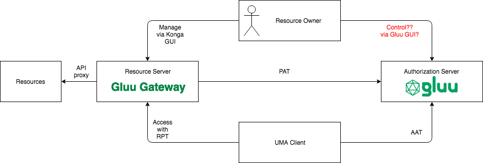

#Gluu Gateway UMA study case.


### 1. Parties




### 2. RS Configuration
1. Resource configuration (Kong API configuration)
````
curl -X POST http://gg.example.com:8001/apis 
    --data "name=demo_api" 
    --data "hosts=demo_host" 
    --data "upstream_url=https://gluu.org"
````

2. Configuration of oAuth plugin

````
curl -X POST http://gg.example.com:8001/apis/demo_api/plugins 
    --data "name=gluu-oauth2-client-auth" 
    --data "config.op_server=https://ce-gluu.example.com" 
    --data "config.oxd_http_url=https://localhost:8443"

````

3. Securing RS with UMA

````
curl -X POST --url http://gg.example.com:8001/apis/demo_api/plugins/ 
    --data "name=gluu-oauth2-rs" 
    --data "config.oxd_host=https://localhost:8443" 
    --data "config.uma_server_host=https://ce-gluu.example.com" 
    --data "config.protection_document=[ { \"path\": \"<YOUR_PATH>\", \"conditions\": [ { \"httpMethods\": [ \"GET\" ], \"scope_expression\": { 
    \"rule\": { \"and\": [ { \"var\": 0 } ] }, \"data\": [ \"http://photoz.example.com/dev/actions/view\" ] } } ] } ]"`
````

protection_document (pretty printed)
```json
[
  {
    "path": "<YOUR_PATH>",
    "conditions": [
      {
        "httpMethods": [
          "GET"
        ],
        "scope_expression": {
          "rule": {
            "and": [
              {
                "var": 0
              }
            ]
          },
          "data": [
            "http:\/\/photoz.example.com\/dev\/actions\/view"
          ]
        }
      }
    ]
  }
]
```
From the last call you get oxd_id, client_id and client_secret
### 3. UMA client registration
1. Register consumer
````
curl -X POST http://gg.example.com:8001/consumers/ 
    --data "username=uma_client"
````
2. Register UMA credentials
````
curl -X POST http://gg.example.com:8001/consumers/uma_client/gluu-oauth2-client-auth/ 
    --data name="uma_consumer_cred" 
    --data op_host="ce-gluu.example.com" 
    --data oxd_http_url="https://localhost:8443" 
    --data uma_mode=true
````
From the last call you get oxd_id, client_id and client_secret

### 4. Call UMA protected API
1. LogIn Consumer
 ````
 curl -X POST https://gg.example.com:8443/get-client-token 
     --data oxd_id="<YOUR_OXD_ID>" 
     --data client_id="<YOUR_CLIENT_ID>" 
     --data client_secret="<YOUR_CLIENT_SECRET>" 
 ````
 From this call you get Consumer accessToken

 2. LogIn UmaResource
  ````
  curl -X POST https://gg.example.com:8443/get-client-token 
      --data oxd_id="<YOUR_UMA_OXD_ID>" 
      --data client_id="<YOUR_UMA_CLIENT_ID>" 
      --data client_secret="<YOUR_UMA_CLIENT_SECRET>" 
  ````
From this call you get resource accessToken

3. Get resource ticket
  ````
  curl -X POST https://gg.example.com:8443/uma-rs-check-access
      --Header "Authorization Bearer <UMA_RESOURCE_TOKEN>"
      --Header "Content-Type: application/json" 
      --data '{"oxd_id": "<YOUR_UMA_OXD_ID>","rpt":"","path":"<YOUR_RESOURCE_PATH>,"http_method" : "<YOUR_RESOURCE_METHOD>" }
'
  ````
 From this call you get ticket
  
4. Get RPT token
  ````
  curl -X POST https://gg.example.com:8443/uma-rp-get-rpt
      --Header "Authorization Bearer <CONSUMER_TOKEN>"
      --Header "Content-Type: application/json" 
      --data '{"oxd_id": "<YOUR_CONSUMER_OXD_ID>","ticket":"<YOUR_TICKET>"}'
````
From this call you get accesstoken (RPT)

5. Call UMA protected API
  ````
  curl -X GET http://gg.example.com:8000/<YOUR_PATH>
      --Header "Authorization: Bearer <YOUR_RPT>"
      --Header "Host: <YOUR_HOST>" 
````

### 5. How to redirect to the claims ??

### 6. Resolve failed UMA policy 

That shows how to configure the RS
