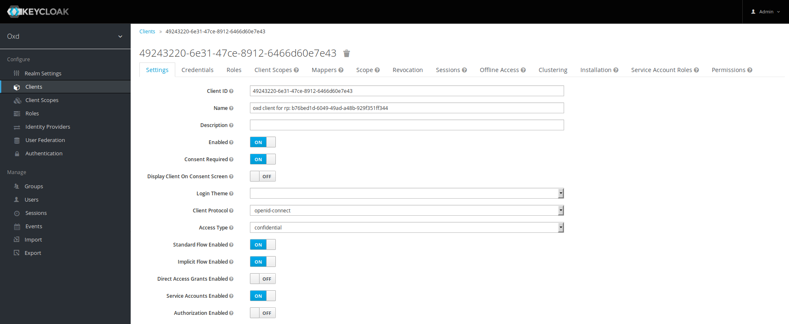
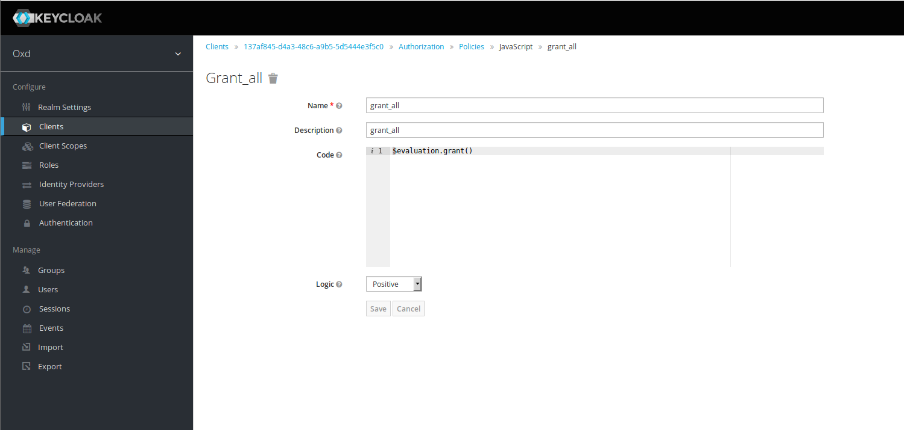
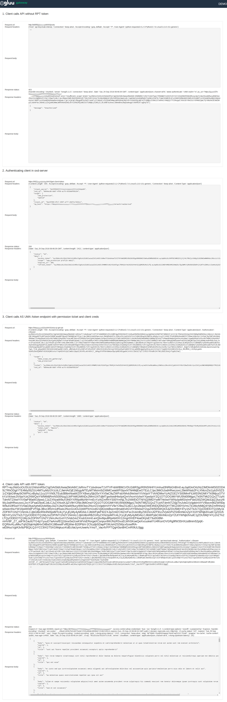

###Gluu Gateway - Keycloak Interoperation

##Description
This configuration is created to visualize the flexibility of Gluu Gateway to work with different IDPs (not only Gluu Server which is the default 
IDP).
Gluu Gateway is a API gateway software which introduces additional layer of resource protection. It gives an easy way to implement User Managed 
Access protocol to RESTful resources. Gluu Gateway is built on top of Kong API Gateway and thus it inherits all functionalities additionally to the
 benefits gained from UMA protocol. 
 
 Gluu Gateway is the first API Gateway which implements UMA protocol and because of open source nature of UMA protocol and Gluu Gateway 
 implementation it is easy to integrate with other vendors. In this article I would like to explain how you can use Gluu Gateway with your Existing
  Keycloak IDP server.

## Architecture

## Custom adjustments
### Keycloak
1. Dynamic client registration creates clients with "Authorization Enabled" set to true
2. Ignore unused json fields in requests (by default keycloak is throwing exception)
3. Change name of token-introspection url in OPIC and UMA discovery point

### Gluu Gateway
1. OXD - Send "token_type_hint" = "requesting_party_token" parameter in order to be able to introspect RPT in Keycloak.
2. Gluu Gateway - Token type recognition

## Configuration steps
### Gluu Gateway setup

#### Gluu Gateway API setup
##### Create API (REST call or Administrator panel)
```aidl
POST /apis HTTP/1.1
Host: gluu-gateway:8001
Content-Type: application/x-www-form-urlencoded

name=api-keycloak-interop&
hosts=api-keycloak-interop&u
pstream_url=https://jsonplaceholder.typicode.com
```

##### Secure it with oauth plugin with Keycloak IDP (REST call or Administrator panel)
```aidl
POST /apis/api-keycloak-interop/plugins HTTP/1.1
Host: gluu-gateway:8001
Content-Type: application/x-www-form-urlencoded

name=gluu-oauth2-client-auth&
config.op_server=https://keycloak-idp.com/auth/realms/oxd&
config.oxd_http_url=https://localhost:8443
```

##### Create UMA resource (only REST api call)
```aidl
POST /apis/api-keycloak-interop/plugins HTTP/1.1
Host: gluu-gateway:8001
Content-Type: application/x-www-form-urlencoded

name=gluu-oauth2-rs&
config.oxd_host=https://localhost:8443&
config.uma_server_host=https://keycloak-idp.com/auth/realms/oxd&
config.protection_document=[ { "path": "/posts", "conditions": [ { "httpMethods": [ "GET" ], "scopes":  ["uma_scope"]} ] } ]
```

##### Resource view in Gluu Gateway

Id in red circle is the id of resource in Keycloak IDP.

#### Gluu Gateway Consumer setup
##### Create consumer
```aidl
POST /consumers HTTP/1.1
Host: gluu-gateway:8001
Content-Type: application/x-www-form-urlencoded

username=keycloak-consumer
```

##### Create credentials
```aidl
POST /consumers/keycloak-consumer/gluu-oauth2-client-auth HTTP/1.1
Host: gluu-gateway:8001
Content-Type: application/x-www-form-urlencoded

name=uma-creds-1537444208&
op_host=https://keycloak-idp.com/auth/realms/oxd&
uma_mode=true&
oxd_http_url=https;//localhost:8443
```

#### Keycloak Resource policy setup
1. Find client using id from [Resurce creation](#####Resource view in Gluu Gateway)

2. Go to Authorization -> Resources

3. Create permission and assign desired policy (In example, the policy accepts every call)



### Demo
Demo application is available as cgi python script in [Gluu Gateway github](https://github.com/GluuFederation/gluu-gateway/tree/master/gg-demo).

Demo application steps:
1. Call Gluu Gateway to get resource without token. In response you get UMA ticket.
2. Log in using Consumer credentials in OXD server. In response you get access token.
3. Call OXD using access token and ticket to get RPT. In response you get RPT.
4. Call Gluu Gateway with RPT to get resource. In response you get resource.
